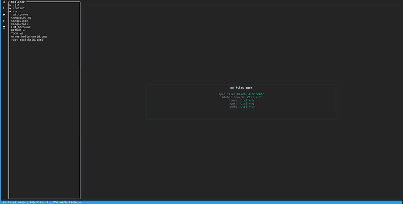

<p align="center">
  
</p>

<h4 align="center">Ryp is a highly customizable GUI & TUI text editor.</h4>

<p align="center">
  <a>
    
  </a>
  <a href="https://github.com/sammwyy/ryp/issues">
    
  </a>
  <a href="https://github.com/sammwyy/ryp/issues">
    
  </a>
  <a href="https://github.com/sammwyy/ryp/commits">
    
  </a>
</p>

<p align="center">
  <a href="#usage">Usage</a> •
  <a href="#requirements">Requirements</a> •
  <a href="#installing">Installing</a> •
  <a href="#support">OS Support</a>
</p>

<p align="center">
  
</p>

<!-- This is used to prevent a grouping bar between the gif and Usage -->
<br>

## Usage
```
Usage: ryp [OPTIONS]
    Edit text via a GUI or TUI editor.

Options:
  --help, -h       Prints the Usage of Ryp
  --version, -v    Prints the current version of Ryp
  --gui            Opens Ryp in a GUI interface
  --tui            Explicitly opens Ryp in a TUI interface (default)
  --admin, -a      Runs Ryp as admin
  --wait, -w       Waits for you to press enter
  --question, -q   Asks if you want to continue or not
```

# Installing
> There is currently no way to install Ryp.<br>
> That is still being worked on.

# Support
<!-- Linux isn't an OS, but I'm refering to the eco sysyem as a whole -->
### OS
`Linux` •
`Windows` •
`MacOS` •
`FreeBSD` •
`OpenBSD` •
`NetBSD` •
`DragonflyBSD`

### Arch
`x86_64` •
`x86`

## How to contribute
To contribute, head to [here](https://github.com/sammwyy/ryp/issues), and make a report.<br>
Or, fork Ryp, make changes, then push them.
